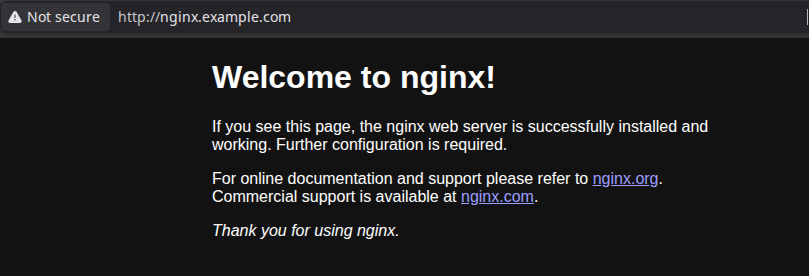
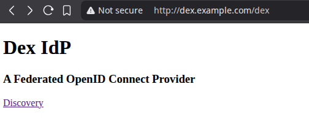
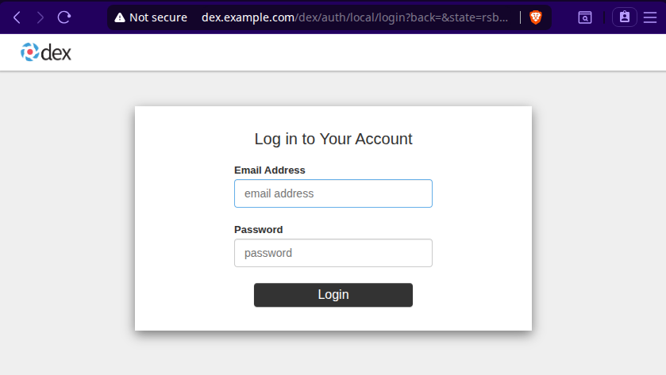
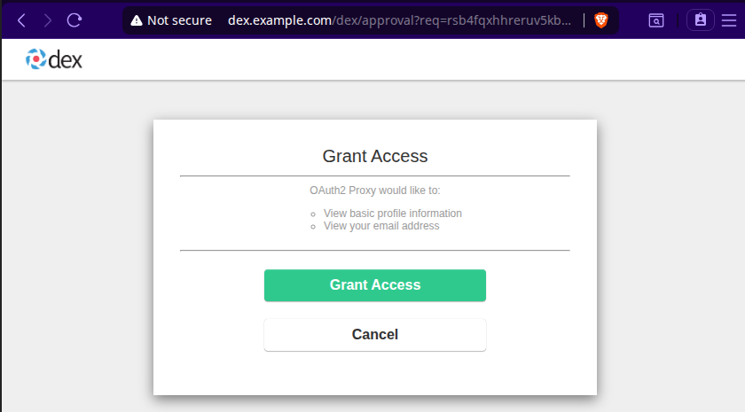
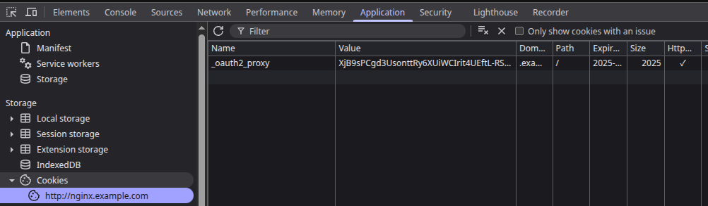

With [Gateway API](https://gateway-api.sigs.k8s.io/) becoming more wide spread and the idea being that it will [replace Ingress in the future](https://kubernetes.io/blog/2022/07/13/gateway-api-graduates-to-beta/) and after it finally reached [GA](https://kubernetes.io/blog/2023/10/31/gateway-api-ga/) last October. I wanted to see how far it’s come and if I could make it play nicely with Istio. On top of that, I wanted to use my beloved [OAuth2 Proxy](https://github.com/oauth2-proxy/oauth2-proxy) to secure endpoints through Istio integration, completely transparent for the underlying applications running in the cluster.

The following setup ended up being the cleanest way I found to run Gateway API with Istio and OAuth2 Proxy on a local test setup using kind. 


As stated above, the goal is transparent authorization handling applications shouldn't know or care that authorization exists. Everything runs locally on kind, Dex acts as the OIDC provider, and nginx gets secured behind OAuth2 Proxy through Istio's external authorization.

Kind cluster config for local port mapping and exposure:

```yaml
# kind-config.yaml
kind: Cluster
apiVersion: kind.x-k8s.io/v1alpha4
nodes:
  - role: control-plane
    extraPortMappings:
      - containerPort: 30080 # we will expose the istio gateway on this nodeport
        hostPort: 80
        listenAddress: "0.0.0.0"
```

```bash
kind create cluster --name istio --config kind-config.yaml
```

Install upstream Gateway API CRDs

```bash
kubectl get crd gateways.gateway.networking.k8s.io &> /dev/null || \
  { kubectl kustomize "github.com/kubernetes-sigs/gateway-api/config/crd?ref=v1.3.0" | kubectl apply -f -; }
```


Now let’s bring in Istio. And because I prefer not relying on a magic CLI installer that changes under your feet, I'm going with Helm. I most always want control over what gets installed. Less "black box magic" and rather more "I know what that YAML actually did".

```bash
# Add helm repo for istio
helm repo add istio https://istio-release.storage.googleapis.com/charts

# Install base
helm install --create-namespace -n istio-system istio-base istio/base
# Install cni
helm install -n kube-system istio-cni istio/cni
```

First Istiod(aemon) config for getting things up and running

```yaml
# istiod-1.yaml
pilot:
  cni:
    enabled: true
    chained: true
  env:
    ENABLE_NATIVE_SIDECARS: true

global:
  proxy:
    resources:
      requests:
        cpu: 10m
        memory: 128Mi

meshConfig:
  defaultConfig:
    gatewayTopology:
      numTrustedProxies: 1
  accessLogFile: /dev/stdout
```

Install Istiod using Helm:

```bash
helm install -n istio-system istiod istio/istiod -f istiod-1.yaml
```

Now let's create an Istio managed Gateway using Gateway API in the gateway namespace:
```yaml
# istio-gateway.yaml
kind: Gateway
apiVersion: gateway.networking.k8s.io/v1beta1
metadata:
  name: istio-gateway
  namespace: gateway
spec:
  gatewayClassName: istio
  listeners:
  - name: http
    protocol: HTTP
    port: 80
    nodePort:
    allowedRoutes:
      namespaces:
        from: All
```

Apply the gateway:
```bash
kubectl create ns gateway
kubectl apply -f istio-gateway.yaml
```

This has created a deployment and a service for the gateway. To actually get this exposed and accessible from outside of kind on our host machine. We need to patch the NodePort of the gateway service to 30080 as defined in the kind port mapping above.

```bash
kubectl patch service istio-gateway-istio -n gateway --type='json' -p='[{"op": "replace", "path": "/spec/ports/1/nodePort", "value": 30080}]'
```


Now for testing connectivity we need an application! And what better to choose than trusty old nginx. (Not to be confused with ingress-nginx, just a plain nginx deployment)

```bash
# ensure istio sidecar mode works for default namespace
kubectl label namespace default istio-injection=enabled 
# really basic nginx deployment and service
kubectl create deployment nginx --image nginx --port 80
kubectl create service clusterip nginx --tcp=80:80
```

Now when checking the nginx pods, the keen-eyed amoung you will notice that you have two containers instead of one. Meaning istio properly did its job and injected a sidecar for service meshing and in-cluster mTLS works.
```bash
kubectl get pods
NAME                     READY   STATUS    RESTARTS   AGE
nginx-66d5678f55-fgh59   2/2     Running   0          5s
```

Lets expose this freshly started nginx via HTTPRoute:
```yaml
# nginx-httproute.yaml
apiVersion: gateway.networking.k8s.io/v1beta1
kind: HTTPRoute
metadata:
  name: nginx
spec:
  hostnames:
    - nginx.example.com
  parentRefs:
    - kind: Gateway
      name: istio-gateway
      namespace: gateway
  rules:
    - backendRefs:
        - kind: Service
          name: nginx
          port: 80
      matches:
        - path:
            type: PathPrefix
            value: /
```

Apply route and test the connectivity:
```bash
kubectl apply -f nginx-httproute.yaml
curl -H "Host: nginx.example.com" http://localhost

  <!DOCTYPE html>
  <html>
  <head>
  <title>Welcome to nginx!</title>
  ...
```

If you get the classic nginx welcome page, routing works.
So far, so good.

Congrats we have Gateway API up and running on our local kind.

Let's add some host entries for browser testing:

```bash
# /etc/hosts
127.0.0.1 nginx.example.com dex.example.com
```

Open your browser, navigate to `nginx.example.com` and you should see the welcome page:



Now how do we implement the SSO integration with Dex + OAuth2 Proxy + Istio?

First Dex. Simple and self-contained identity in a box:
```yaml
# dex-values.yaml
service:
  ports:
    http:
      port: 80 # To make local routing possible default would be 5556
config:
    issuer: http://dex.example.com/dex
    storage:
      type: sqlite3
      config:
        file: /var/dex/dex.db
    web:
      http: 0.0.0.0:4190
    oauth2:
      skipApprovalScreen: true
    expiry:
      signingKeys: "4h"
      idTokens: "1h"
    staticClients:
      - id: oauth2-proxy
        redirectURIs:
          - "http://nginx.example.com/oauth2/callback"
        name: "OAuth2 Proxy"
        secret: b2F1dGgyLXByb3h5LWNsaWVudC1zZWNyZXQK
    enablePasswordDB: true
    staticPasswords:
      - email: "admin@example.com"
        # bcrypt hash of the string "password"
        hash: "$2a$10$2b2cU8CPhOTaGrs1HRQuAueS7JTT5ZHsHSzYiFPm1leZck7Mc8T4W"
        username: "admin"
        userID: "08a8684b-db88-4b73-90a9-3cd1661f5466"
```

Installing Dex:

```bash
# Official helm chart
helm repo add dex https://charts.dexidp.io
# Our sso namespace for dex and oauth2-proxy. Obviously you could use another OIDC identity provider like keycloak or gitlab
kubectl create ns sso 
helm install -n sso dex dex/dex -f dex-values.yaml

# Get the installed service and copy it's IP
kubectl -n sso get service
NAME   TYPE        CLUSTER-IP     EXTERNAL-IP   PORT(S)             AGE
dex    ClusterIP   10.96.91.194   <none>        5556/TCP,5558/TCP   1s
```


Next up, OAuth2 Proxy. Unfortunately, for our local setup to properly work we need to make sure it can resolve `dex.example.com`, since kind doesn’t do any fancy DNS magic for that. Just grab Dex's ClusterIP and use a host alias.

```yaml
# oauth2-proxy-values.yaml
hostAliases:
  - ip: "10.96.91.194"
    hostnames:
    - "dex.example.com" 
config:
  clientID: "oauth2-proxy"
  clientSecret: "b2F1dGgyLXByb3h5LWNsaWVudC1zZWNyZXQK"
  cookieSecret: "OQINaROshtE9TcZkNAm-5Zs2Pv3xaWytBmc5W7sPX7w="
  configFile: |-
    provider = "oidc"
    upstreams = [ "static://200" ]
    cookie_domains = [".example.com"]
    email_domains = [ "*" ]
    cookie_secure = false # again only for the local setup as we don't want to hassle around with SSL right now
    skip_provider_button = true
    silence_ping_logging = true
    reverse_proxy = true
    oidc_issuer_url="http://dex.example.com/dex"
```

Install OAuth2 Proxy:
```bash
# Official helm chart
helm repo add oauth2-proxy https://oauth2-proxy.github.io/manifests

# Install in sso namespace
helm install -n sso oauth2-proxy oauth2-proxy/oauth2-proxy -f oauth2-proxy-values.yaml
```

After a couple seconds, both Dex and OAuth2 Proxy should be up:

```bash
kubectl -n sso get pods
NAME                            READY   STATUS    RESTARTS   AGE
dex-76c8f96fb4-r4r6w            1/1     Running   0          46s
oauth2-proxy-6ff57b99f9-6f622   1/1     Running   0          13s
```

We haven't activated the istio sidecar injection for the sso namespace but it should work with or without it.

Now, the HTTPRoutes for Dex and OAuth2 Proxy:
```yaml
# sso-httproute.yaml
---
apiVersion: gateway.networking.k8s.io/v1beta1
kind: HTTPRoute
metadata:
  name: dex
  namespace: sso
spec:
  hostnames:
    - dex.example.com
  parentRefs:
    - kind: Gateway
      name: istio-gateway
      namespace: gateway
  rules:
    - backendRefs:
        - kind: Service
          name: dex
          port: 80  # To make local routing possible
      matches:
        - path:
            type: PathPrefix
            value: /
---
apiVersion: gateway.networking.k8s.io/v1beta1
kind: HTTPRoute
metadata:
  name: oauth2-proxy
  namespace: sso
spec:
  hostnames:
    # Here is the magic. Same domain as the protected applications
    - nginx.example.com 
  parentRefs:
    - kind: Gateway
      name: istio-gateway
      namespace: gateway
  rules:
    - backendRefs:
        - kind: Service
          name: oauth2-proxy
          port: 80
      matches:
        - path:
            type: PathPrefix
            value: /oauth2
```

Quick connectivity test:

```bash
# Dex
curl -H "Host: dex.example.com" http://localhost/dex
<!DOCTYPE html>
                        <title>Dex</title>
                        <h1>Dex IdP</h1>
                        <h3>A Federated OpenID Connect Provider</h3>
                        <p><a href="http://dex.example.com/dex/.well-known/openid-configuration">Discovery</a></p>

# OAuth2 Proxy via nginx.example.com
curl -H "Host: nginx.example.com" http://localhost/oauth2/auth
Unauthorized
```

Open Dex in your browser to verify:



Both look good and as expected. Now how do we actually use our running OAuth2 Proxy and Dex instances without touching our application (in our test the nginx deployment)?

Let's plug OAuth2 Proxy into Istio so that everything behind it magically becomes "protected by SSO" without touching the application deployment. This part is why I wanted to do all of this. Finally!

Reconfigure Istiod by adding an extension provider:
```yaml
# istiod-2.yaml
pilot:
  cni:
    enabled: true
    chained: true
  env:
    ENABLE_NATIVE_SIDECARS: true

global:
  proxy:
    resources:
      requests:
        cpu: 10m
        memory: 128Mi

meshConfig:
  defaultConfig:
    gatewayTopology:
      numTrustedProxies: 1
  accessLogFile: /dev/stdout
  # This part is new
  extensionProviders:
    - name: "oauth2-proxy"
      envoyExtAuthzHttp:
        service: "oauth2-proxy.sso.svc.cluster.local"
        port: "80"
        includeHeadersInCheck: [
            "authorization",
            "cookie",
            "from",
            "accept",
            "user-agent",
            "proxy-authorization",
            "x-forwarded-host",
            "x-forwarded-for",
            "x-auth-request-redirect",
          ] # headers sent to the oauth2-proxy in the check request.
        headersToUpstreamOnAllow: [] # headers sent to backend application when request is allowed.
        headersToDownstreamOnDeny: ["content-type", "set-cookie"] # headers sent back to the client when request is denied.
```

Upgrade Istiod:
```bash
helm upgrade -n istio-system istiod istio/istiod -f istiod-2.yaml
```

Last but not least, we can apply so called [AuthorizationPolicies](https://istio.io/latest/docs/reference/config/security/authorization-policy/) to Istio (Remember they are namespace bound). In our case we will create an `AuthorizationPolicy` of action type `CUSTOM`. The other two options would be `DENY` or `ALLOW`, as most of you will be used to from configuring firewalls.

```yaml
# auth-policy.yaml
apiVersion: security.istio.io/v1
kind: AuthorizationPolicy
metadata:
  name: oauth2-policy
spec:
  action: CUSTOM
  provider:
    name: oauth2-proxy
  rules:
  - to:
    - operation:
        paths: ["/"]  # protect everything under the root path
```

AuthorizationPolicies allow for a bunch of operations. Like matching for the path, matching for certain headers, hosts and wildcards. One useful header to remember,  is the `request.headers[X-Envoy-External-Address]` it stores the original requesting IP of incoming requests similar to `X-Forwarded-For`.

For my purposes the above matching on all path's below the root is fine.

And the last step: Force reload the MeshConfig and Policies by restarting the Istio Daemon and the Gateway (optional).

```bash
kubectl -n istio-system rollout restart deployment
kubectl -n gateway rollout restart deployment istio-gateway-istio
```

Now when trying to open nginx.example.com in your browser, you will be redirected to dex.example.com:



Sign in using:
* Email: admin@example.com
* Password: password

After granting access, you'll get bounced back to nginx:




You're now officially logged in. OAuth2 Proxy stored a cookie, and all later requests just use that as you can see in the Chrome Developer Tools:


